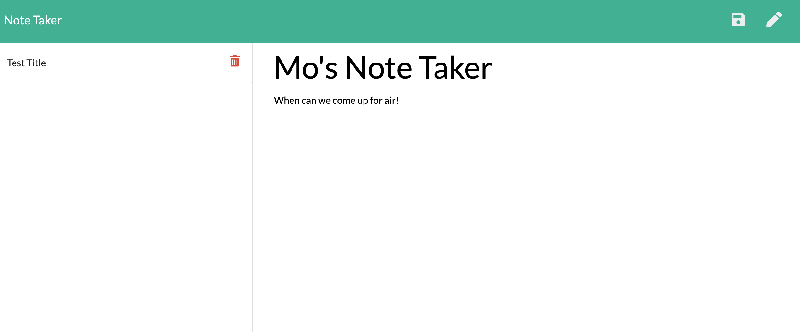

# Notetaker-App

## Description 

* The motivation for creating the Notetaker appplication is centered arrround accessability and convience.  This application can be used to write, save and delete notes. It is designed for users that need to track a lot of information while on the fly.  

## Technology Used

* This application will use Express.js on the backend and save and retrieve data from a JSON file.  Other new technologies used were Heroku for deployment. 

## Future Development (Ice Box)

* Continue adding more functionality and features to the app.  Currently I've delivered the Most Viable Product (MVP) to the consumer.  We will continue to work in a beta environment and have all of the functionilty in place in time for the next portfolio update
